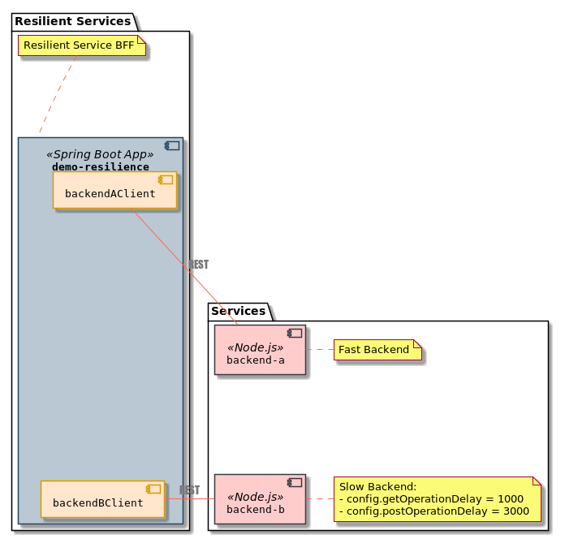

# Demo resilience

Demo resilience is a demo project showing how to use resilience4j & spring boot.

Resilience patterns are applied to a Spring Boot application which connects with two services implemented with Node.js 



## Build
* Spring Boot Project
```shell script
./gradlew bootJar
```
* External service image 
```shell script
docker build external-service -t external-service
```

## Local Run
* Run external services 
```shell script
# run service-a
docker stop service-a
docker rm service-a
docker run -d \
-p 8081:80 \
-v "$(pwd)/src/main/k8s/config/service-a":"/usr/src/app/config" \
--name service-a \
external-service:latest

# test service-a
curl -X GET http://localhost:8081/message -H "Accept: application/json"
curl -X POST http://localhost:8081/message -H "Content-type: application/json" -d '{"sample-attr": "test"}'

# run service-b
docker stop service-b
docker rm service-b
docker run -d \
-p 8082:80 \
-v "$(pwd)/src/main/k8s/config/service-b":"/usr/src/app/config" \
--name service-b \
external-service:latest

# test service-b
curl -X GET http://localhost:8082/message -H "Accept: application/json"
curl -X POST http://localhost:8082/message -H "Content-type: application/json" -d '{"sample-attr": "test"}'
```

* Run Spring Boot Project
```shell script
# start service
./gradlew bootRun -Pargs="-Dservices.backendA.base-url=http://localhost:8081,-Dservices.backendB.base-url=http://localhost:8082"

# test service
curl -X GET http://localhost:8080/serviceA -H "Accept: application/json"
curl -X POST http://localhost:8080/serviceA -H "Content-type: application/json" -d '{"sample-attr": "test"}'

curl -X GET http://localhost:8080/serviceB -H "Accept: application/json"
curl -X POST http://localhost:8080/serviceB -H "Content-type: application/json" -d '{"sample-attr": "test"}'
```

* Test
```shell script
# stop service-a
docker stop service-a

# stop service-b
docker stop service-b

```

## Local Run (KinD + skaffold)
### install skaffold
```shell script
curl -Lo skaffold https://storage.googleapis.com/skaffold/releases/latest/skaffold-linux-amd64
sudo install skaffold /usr/local/bin/
```
### install kustomize
```shell script
curl -s "https://raw.githubusercontent.com/\
kubernetes-sigs/kustomize/master/hack/install_kustomize.sh"  | bash
sudo chown root:root kustomize
sudo mv kustomize /usr/local/bin/
```

### Install KindD
```shell script
sudo curl -Lo /usr/local/bin/kind https://kind.sigs.k8s.io/dl/v0.8.1/kind-$(uname)-amd64 && sudo chmod +x /usr/local/bin/kind
# see: https://kind.sigs.k8s.io/docs/user/ingress/
cat <<EOF | kind create cluster --config=-
kind: Cluster
apiVersion: kind.x-k8s.io/v1alpha4
nodes:
- role: control-plane
  kubeadmConfigPatches:
  - |
    kind: InitConfiguration
    nodeRegistration:
      kubeletExtraArgs:
        node-labels: "ingress-ready=true"
  extraPortMappings:
  - containerPort: 80
    hostPort: 80
    protocol: TCP
  - containerPort: 443
    hostPort: 443
    protocol: TCP
EOF

kubectl apply -f https://raw.githubusercontent.com/kubernetes/ingress-nginx/master/deploy/static/provider/kind/deploy.yaml
```
### Run Skaffold
* Edit hosts file
```shell script
# edit hosts file
sudo vi /etc/hosts
cat /etc/hosts | grep localhost
127.0.0.1       localhost demo-resilience.local-k8s
```

* Run
```shell script
skaffold dev --trigger notify
```

* Test services (Node Port)
```shell script
kubectl get nodes -o wide
# external-ip = 172.18.0.2
# service a
curl -X POST http://172.18.0.2:30080/message -H "Content-type: application/json" -d '{"sample-attr": "test"}'
# service b
curl -X POST http://172.18.0.2:30081/message -H "Content-type: application/json" -d '{"sample-attr": "test"}'
```
* test
```shell script
curl http://demo-resilience.local-k8s/api/actuator/health
curl http://demo-resilience.local-k8s/api/actuator/prometheus

#service A
curl http://demo-resilience.local-k8s/api/serviceA
curl -X POST http://demo-resilience.local-k8s/api/serviceA -H "Content-type: application/json" -d '{"sample-attr": "test"}'

#service A
curl http://demo-resilience.local-k8s/api/serviceB
curl -X POST http://demo-resilience.local-k8s/api/serviceB -H "Content-type: application/json" -d '{"sample-attr": "test"}'


#disable service a
kubectl patch service service-a -p '{"spec":{"selector":{"name": "service-unknown"}}}'
#enable service a
kubectl patch service service-a -p '{"spec":{"selector":{"name": "service-a"}}}'

```
### Prometheus
Check the Prometheus server.
- Open http://demo-resilience.local-k8s/prometheus/
- Access status -> Targets, both endpoints must be "UP"

### Grafana
Configure the Grafana.
- Open http://demo-resilience.local-k8s/grafana/
- **Configure integration with Prometheus**
    - Access configuration
    - Add data source
    - Select Prometheus
    - Use url "http://prometheus:9090" and access with value "Server"
- **Configure dashboard**
    - Access "home"
    - Import dashboard
    - Upload dashboard.json from /docker


### monitoring
* Actuator: http://demo-resilience.local-k8s/api/actuator/health
* Prometheus: http://demo-resilience.local-k8s/prometheus/
* Grafana: http://demo-resilience.local-k8s/grafana/
